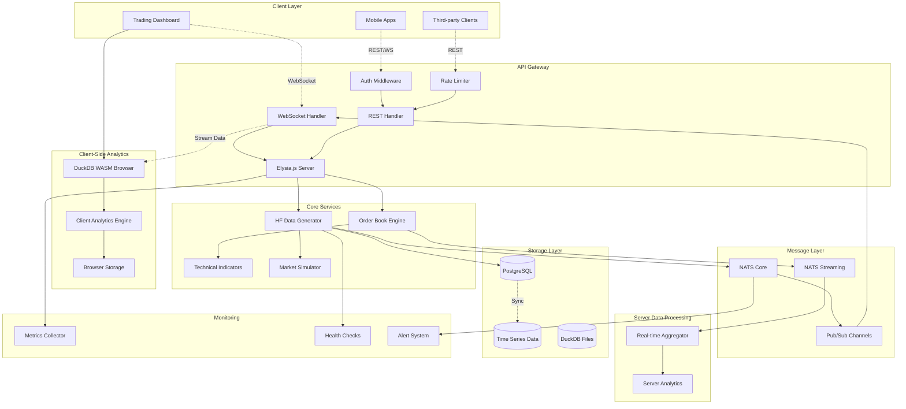

# Stock Trading Data API - Design Document

## Overview

The Stock Trading Data API is a high-performance, real-time trading platform that simulates institutional-grade stock market activity. The system generates realistic high-frequency trading data, stores it efficiently using a dual-database approach (PostgreSQL + DuckDB WASM), and streams real-time updates to connected clients with sub-second latency.

The architecture leverages Elysia.js for high-performance API endpoints, NATS for message streaming, DuckDB WASM for analytical processing, and provides a comprehensive trading dashboard for real-time market visualization.

## Architecture

### System Architecture Diagram



### Technology Stack

- **Runtime**: Bun (for optimal performance)
- **Web Framework**: Elysia.js (high-performance TypeScript framework)
- **Message Broker**: NATS (real-time streaming)
- **Primary Database**: PostgreSQL (persistence and ACID compliance)
- **Browser Analytics**: DuckDB WASM (client-side high-performance analytics)
- **Authentication**: Better Auth (existing integration)
- **Frontend**: React with real-time WebSocket connections

### Browser-Server Architecture

**Server Responsibilities**:

- Generate high-frequency trading data
- Maintain order books and market state
- Stream real-time data via WebSocket
- Provide REST APIs for historical data
- Handle authentication and rate limiting

**Browser Responsibilities**:

- Receive real-time data streams via WebSocket
- Store recent trading data locally using DuckDB WASM
- Perform complex analytics and calculations client-side
- Render real-time charts and trading dashboard
- Maintain responsive UI with sub-second updates

**Data Flow**:

1. Server generates trading data and streams via WebSocket
2. Browser receives data and ingests into local DuckDB WASM instance
3. Client-side analytics engine processes data for charts and indicators
4. Dashboard updates in real-time without server round-trips for analytics
5. Historical data requests still go to server when needed

## Components and Interfaces

### 1. Data Generation Engine

**Purpose**: Generate realistic high-frequency trading data that mimics real market conditions.

**Key Features**:

- Supports 50+ major stock symbols with realistic market cap weighting
- Generates 100-1000 trades per minute per symbol
- Implements realistic price movement patterns (trending, mean reversion, volatility clustering)
- Simulates market microstructure (bid-ask spreads, order book depth)

**Interface**:

```typescript
interface DataGeneratorService {
  startGeneration(symbols: string[]): Promise<void>;
  stopGeneration(symbols?: string[]): Promise<void>;
  configureSymbol(symbol: string, config: SymbolConfig): Promise<void>;
  getGenerationStatus(): GenerationStatus;
}

interface SymbolConfig {
  basePrice: number;
  volatility: number;
  trendStrength: number;
  minSpread: number;
  maxSpread: number;
  volumeProfile: VolumeProfile;
}

interface TradeData {
  id: string;
  symbol: string;
  price: number;
  quantity: number;
  side: "BUY" | "SELL";
  timestamp: Date;
  orderId?: string;
}
```

### 2. Order Book Engine

**Purpose**: Maintain real-time order books for each symbol with market depth simulation.

**Key Features**:

- Real-time bid/ask price levels
- Market depth visualization (Level 2 data)
- Order book snapshots and incremental updates
- Spread calculation and monitoring

**Interface**:

```typescript
interface OrderBookEngine {
  getOrderBook(symbol: string): OrderBook;
  subscribeToUpdates(symbol: string, callback: OrderBookUpdateCallback): void;
  getMarketDepth(symbol: string, levels: number): MarketDepth;
}

interface OrderBook {
  symbol: string;
  bids: PriceLevel[];
  asks: PriceLevel[];
  lastUpdate: Date;
  spread: number;
}

interface PriceLevel {
  price: number;
  quantity: number;
  orderCount: number;
}
```

### 3. Client-Side DuckDB WASM Analytics Engine

**Purpose**: Provide high-performance analytical queries directly in the browser using DuckDB WASM for real-time data analysis without server round-trips.

**Key Features**:

- Browser-based analytical processing with sub-100ms query response times
- Real-time OHLCV calculations on streaming data
- Technical indicators computed client-side (moving averages, RSI, MACD)
- Complex aggregations on cached trading data
- Arrow-based data interchange for optimal performance
- Offline analytics capabilities with locally stored data

**Implementation Details**:

- DuckDB WASM runs entirely in the browser's WebAssembly environment
- Streaming data from WebSocket is continuously ingested into DuckDB tables
- Client maintains a rolling window of recent trading data (configurable, e.g., last 24 hours)
- Complex queries execute locally without server load
- Results update in real-time as new data arrives

**Interface**:

```typescript
interface ClientAnalyticsEngine {
  initializeDatabase(): Promise<void>;
  ingestStreamingData(trades: TradeData[]): Promise<void>;
  calculateOHLCV(
    symbol: string,
    interval: TimeInterval,
    limit: number,
  ): Promise<OHLCV[]>;
  getTechnicalIndicators(
    symbol: string,
    indicators: IndicatorType[],
  ): Promise<TechnicalIndicatorData>;
  executeCustomQuery(sql: string): Promise<QueryResult>;
  getLocalDataStats(): Promise<DataStats>;
  clearOldData(retentionHours: number): Promise<void>;
}

interface DataStats {
  totalTrades: number;
  symbolCount: number;
  dataRangeStart: Date;
  dataRangeEnd: Date;
  memoryUsage: number;
}

interface OHLCV {
  timestamp: Date;
  open: number;
  high: number;
  low: number;
  close: number;
  volume: number;
}
```

### 4. Real-time Streaming Service

**Purpose**: Handle WebSocket connections and real-time data distribution to clients.

**Key Features**:

- Sub-25ms latency for data distribution
- Configurable subscription levels (trades, quotes, order book)
- Connection management and automatic reconnection
- Message compression for bandwidth optimization

**Interface**:

```typescript
interface StreamingService {
  subscribe(clientId: string, subscriptions: Subscription[]): void;
  unsubscribe(clientId: string, subscriptions: Subscription[]): void;
  broadcast(channel: string, data: any): void;
  getConnectionCount(): number;
}

interface Subscription {
  type: "trades" | "quotes" | "orderbook" | "ohlcv";
  symbols: string[];
  interval?: TimeInterval;
}
```

### 5. REST API Endpoints

**Purpose**: Provide comprehensive REST endpoints for data access and system management.

**Endpoints**:

```typescript
// Market Data Endpoints
GET /api/v1/symbols                    // List all available symbols
GET /api/v1/quotes/:symbol             // Current quote for symbol
GET /api/v1/trades/:symbol             // Recent trades for symbol
GET /api/v1/orderbook/:symbol          // Order book snapshot
GET /api/v1/ohlcv/:symbol              // OHLCV data with intervals

// Historical Data Endpoints
GET /api/v1/history/trades/:symbol     // Historical trades with pagination
GET /api/v1/history/ohlcv/:symbol      // Historical OHLCV data
GET /api/v1/analytics/indicators/:symbol // Technical indicators

// System Management Endpoints
POST /api/v1/admin/generation/start    // Start data generation
POST /api/v1/admin/generation/stop     // Stop data generation
GET /api/v1/admin/status               // System health and metrics
GET /api/v1/admin/metrics              // Performance metrics

// WebSocket Endpoint
WS /api/v1/stream                      // Real-time data streaming
```

## Data Models

### Database Schema Extensions

```sql
-- Extend existing StockTrade table
ALTER TABLE stock_trade ADD COLUMN order_id VARCHAR(50);
ALTER TABLE stock_trade ADD COLUMN trade_type VARCHAR(20) DEFAULT 'MARKET';
ALTER TABLE stock_trade ADD COLUMN execution_venue VARCHAR(50);

-- Order Book table
CREATE TABLE order_book_snapshot (
    id SERIAL PRIMARY KEY,
    symbol VARCHAR(10) NOT NULL,
    side VARCHAR(4) NOT NULL CHECK (side IN ('BUY', 'SELL')),
    price DECIMAL(10,4) NOT NULL,
    quantity INTEGER NOT NULL,
    order_count INTEGER DEFAULT 1,
    timestamp TIMESTAMP DEFAULT CURRENT_TIMESTAMP,

    INDEX idx_symbol_timestamp (symbol, timestamp),
    INDEX idx_symbol_side_price (symbol, side, price)
);

-- OHLCV aggregated data
CREATE TABLE ohlcv_data (
    id SERIAL PRIMARY KEY,
    symbol VARCHAR(10) NOT NULL,
    interval_type VARCHAR(10) NOT NULL, -- '1s', '1m', '5m', '1h', '1d'
    timestamp TIMESTAMP NOT NULL,
    open_price DECIMAL(10,4) NOT NULL,
    high_price DECIMAL(10,4) NOT NULL,
    low_price DECIMAL(10,4) NOT NULL,
    close_price DECIMAL(10,4) NOT NULL,
    volume BIGINT NOT NULL,
    trade_count INTEGER DEFAULT 0,

    UNIQUE KEY unique_symbol_interval_time (symbol, interval_type, timestamp),
    INDEX idx_symbol_interval_timestamp (symbol, interval_type, timestamp)
);

-- Symbol configuration
CREATE TABLE symbol_config (
    symbol VARCHAR(10) PRIMARY KEY,
    base_price DECIMAL(10,4) NOT NULL,
    volatility DECIMAL(5,4) DEFAULT 0.02,
    trend_strength DECIMAL(5,4) DEFAULT 0.0,
    min_spread DECIMAL(8,4) DEFAULT 0.01,
    max_spread DECIMAL(8,4) DEFAULT 0.05,
    is_active BOOLEAN DEFAULT true,
    created_at TIMESTAMP DEFAULT CURRENT_TIMESTAMP,
    updated_at TIMESTAMP DEFAULT CURRENT_TIMESTAMP ON UPDATE CURRENT_TIMESTAMP
);
```

### DuckDB Schema

```sql
-- High-performance analytics tables in DuckDB
CREATE TABLE trades_analytics AS
SELECT * FROM read_parquet('trades_*.parquet');

CREATE TABLE ohlcv_analytics AS
SELECT * FROM read_parquet('ohlcv_*.parquet');

-- Materialized views for common queries
CREATE VIEW symbol_stats AS
SELECT
    symbol,
    COUNT(*) as trade_count,
    AVG(price) as avg_price,
    STDDEV(price) as price_volatility,
    SUM(quantity) as total_volume,
    MIN(timestamp) as first_trade,
    MAX(timestamp) as last_trade
FROM trades_analytics
GROUP BY symbol;
```

## Error Handling

### Error Categories and Responses

1. **Data Generation Errors**
   - Symbol configuration errors
   - Market simulation failures
   - Data validation errors

2. **Database Errors**
   - Connection failures
   - Query timeouts
   - Data consistency issues

3. **Streaming Errors**
   - WebSocket connection drops
   - Message delivery failures
   - Subscription management errors

4. **API Errors**
   - Authentication failures
   - Rate limiting violations
   - Invalid request parameters

### Error Response Format

```typescript
interface ErrorResponse {
  error: {
    code: string;
    message: string;
    details?: any;
    timestamp: string;
    requestId: string;
  };
}

// Example error responses
{
  "error": {
    "code": "SYMBOL_NOT_FOUND",
    "message": "Symbol 'INVALID' is not supported",
    "details": { "supportedSymbols": ["AAPL", "GOOGL", "TSLA"] },
    "timestamp": "2026-01-25T10:30:00Z",
    "requestId": "req_123456"
  }
}
```

### Circuit Breaker Implementation

```typescript
interface CircuitBreakerConfig {
  failureThreshold: number;
  recoveryTimeout: number;
  monitoringPeriod: number;
}

class CircuitBreaker {
  private state: "CLOSED" | "OPEN" | "HALF_OPEN" = "CLOSED";
  private failureCount = 0;
  private lastFailureTime?: Date;

  async execute<T>(operation: () => Promise<T>): Promise<T> {
    if (this.state === "OPEN") {
      if (this.shouldAttemptReset()) {
        this.state = "HALF_OPEN";
      } else {
        throw new Error("Circuit breaker is OPEN");
      }
    }

    try {
      const result = await operation();
      this.onSuccess();
      return result;
    } catch (error) {
      this.onFailure();
      throw error;
    }
  }
}
```

## Testing Strategy

### 1. Unit Testing

- **Data Generation Logic**: Test price movement algorithms, volume generation, and market simulation
- **Order Book Operations**: Test order book updates, spread calculations, and market depth
- **Analytics Functions**: Test OHLCV calculations, technical indicators, and aggregations
- **API Endpoints**: Test request/response handling, validation, and error cases

### 2. Integration Testing

- **Database Integration**: Test PostgreSQL and DuckDB operations, data synchronization
- **NATS Messaging**: Test message publishing, subscription, and delivery
- **WebSocket Connections**: Test real-time streaming, connection management
- **End-to-End Workflows**: Test complete data flow from generation to client delivery

### 3. Performance Testing

- **Load Testing**: Simulate 1000+ concurrent connections with realistic trading volumes
- **Latency Testing**: Measure end-to-end latency for critical paths (< 25ms target)
- **Throughput Testing**: Verify system can handle 10,000+ trades per second
- **Memory Testing**: Monitor memory usage under sustained high-frequency data generation

### 4. Stress Testing

- **Connection Limits**: Test maximum concurrent WebSocket connections
- **Data Volume**: Test with millions of historical trades and complex queries
- **Network Failures**: Test resilience to network partitions and reconnections
- **Database Failures**: Test graceful degradation when databases are unavailable

### Testing Tools and Framework

- **Unit Tests**: Bun's built-in test runner
- **API Testing**: Supertest for HTTP endpoint testing
- **WebSocket Testing**: Custom WebSocket client for real-time testing
- **Load Testing**: Artillery.js for performance and load testing
- **Database Testing**: Test containers for isolated database testing

### Test Data Management

- **Synthetic Data**: Generate realistic test datasets for various market conditions
- **Data Fixtures**: Predefined datasets for consistent testing scenarios
- **Performance Baselines**: Establish performance benchmarks for regression testing
- **Test Isolation**: Ensure tests don't interfere with each other or production data

This design provides a comprehensive foundation for building a production-grade stock trading data API that meets all the specified requirements while maintaining high performance, scalability, and reliability.
